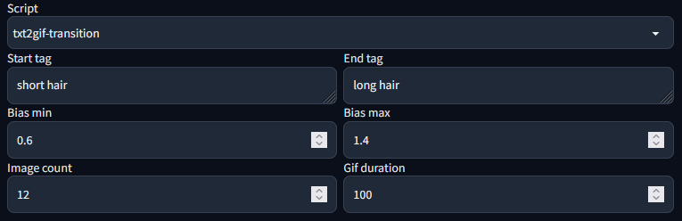

# Stable Diffusion txt2gif Transition

A script for [stable-diffusion-webui](https://github.com/AUTOMATIC1111/stable-diffusion-webui) to generate gifs with a transition.

You can add two tags/words that are gradually transitioned between. The minimum and maximum bias of the tags have an impact on the amount of change from first to last frame. Then you can select the amount of frames you want to generate and the time in ms between each frame.

The setting above will generate a gif with 12 frames and a total animation length of 1.2 seconds (12 * 100ms).

The prompt of the first frame will be prepended by `(short hair:1.4), (long hair: 0.6)` and the last frame by `(short hair:0.6), (long hair: 1.4)` with a linear transition in between the frames.

Multiple tags seperated by comma are supported as well:

Here as a start tag `cute face, blue eyes` is used, end tag is `demon, red eyes`.
